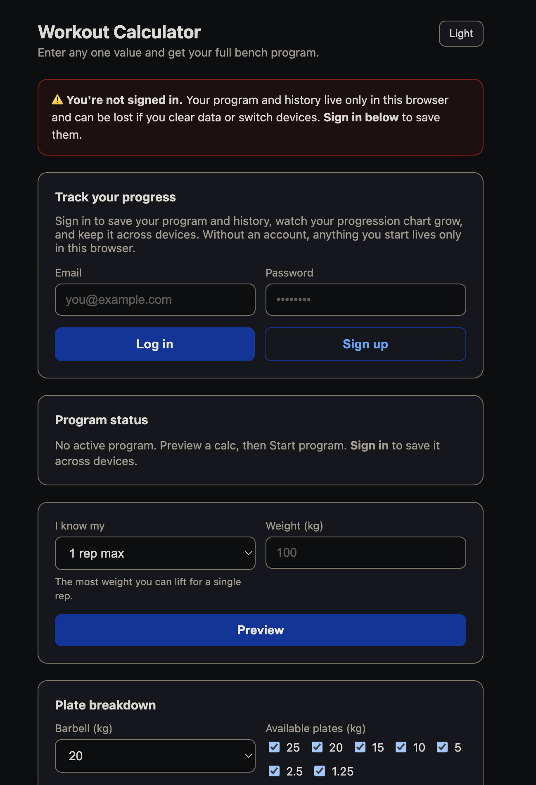

# Workout Calculator

A bench‑press training calculator: enter **any one** number you know about your lift
(1RM, 90% of max, or a working‑set load) and it derives a complete program — all the
training loads plus the next progression. Sign in to save programs, track history, and
watch a progression chart grow over a 3‑week training block.

**Live:** https://workout-calculator.su-souissi.workers.dev



## Why

Lifters usually know *one* reference number (their 1RM, or what they can push for 5×5)
but want the whole picture: what to load for singles, triples, 5×5, and what next week's
target should be. This turns that single input into a full, rounded‑to‑plate program and
keeps a history so you can see progress block over block.

## Features

- **Compute from any input** — give `maxRm`, `max90`, `rep95`, `rep90`, or `rep85`; get the full program. Loads are rounded to the nearest 2.5 kg.
- **Preview vs. Start** — *Preview* computes without saving (play freely); *Start program* commits it as a tracked block.
- **Accounts** — email + password (PBKDF2 hashing), stateless JWTs: a 5‑min access token + 7‑day refresh token in httpOnly cookies, auto‑refreshed by the client.
- **Per‑user history** — stored in Cloudflare D1, scoped per user. Logged out, history lives in `localStorage` and is **merged into your account** on first login.
- **Active‑program status** — tracks the current 3‑week block (week X of 3) and warns before replacing an in‑progress one.
- **Progression chart** — inline SVG, five series, hover tooltips, current point emphasized. No charting library.
- **Plate breakdown** — per lift, plates per side from a selectable barbell weight (10–25 kg) and available plate set; flags an unreachable remainder.
- **PWA** — installable, app shell cached for offline load; theme follows a light/dark toggle.
- **Hardening** — rate‑limited auth (with a daily cron sweep of expired entries) and security headers (CSP, HSTS, `X-Frame-Options`, nosniff).

## Tech stack

- **Runtime:** Cloudflare Workers (TypeScript), zero production dependencies.
- **Data:** Cloudflare D1 (SQLite) — `users` + `history`, plus a `rate_limits` table.
- **Frontend:** a single server‑rendered HTML page with vanilla CSS/JS (no framework, no build step for the UI).
- **Auth:** Web Crypto (PBKDF2 + HMAC‑SHA256 JWT), hand‑rolled, no auth library.
- **Tests:** Vitest. **CI/CD:** GitHub Actions → typecheck, lint, test, deploy on `main`.

## Architecture

Modules touching the database follow a hexagonal split:

- `*.db.ts` — the **only** files that talk to D1 (data access, no domain logic).
- `*.service.ts` — business logic (validation, hashing, token issuing); never imports D1.
- `index.ts` — the Worker: routing, cookies, security headers, and the scheduled (cron) handler.

```
src/
  index.ts              Worker entry: routes, cookies, security headers, cron
  service.ts            Pure calc — generateBenchProgram + per-input variants
  page.ts               The full HTML/CSS/JS app (served as a string)
  pwa.ts                Web manifest, service worker, icon
  history.db.ts         D1 access for per-user history
  types/program.type.ts Program shape
  utils/round.utils.ts  Round-to-2.5kg helper
  auth/
    auth.service.ts     Signup/login/refresh, PBKDF2, validation
    auth.db.ts          D1 access for users
    rate.db.ts          D1 access for rate limits
    jwt.ts              HS256 sign/verify (Web Crypto)
migrations/             D1 schema (0001 init, 0002 rate_limits)
```

## HTTP API

| Method | Path | Purpose |
|---|---|---|
| `GET` | `/` | The app (HTML) |
| `GET` | `/api/program?<input>` | Compute a program (preview, not saved) |
| `GET` | `/api/history` | Current user's saved programs (newest first); `[]` if logged out |
| `POST` | `/api/history` | Save a program to the current user's history |
| `POST` | `/api/history/import` | Merge anonymous `localStorage` history into the account |
| `POST` | `/api/auth/signup` · `/login` · `/refresh` · `/logout` | Auth |
| `GET` | `/api/auth/me` | Current user or `null` |
| `GET` | `/manifest.webmanifest` · `/sw.js` · `/icon.svg` | PWA assets |

## Local development

```bash
npm install
echo "AUTH_SECRET=dev-secret" > .dev.vars      # local signing secret
npm run db:migrate -- --local                  # create local D1 tables
npm run dev                                     # wrangler dev
```

Scripts: `dev`, `build`, `typecheck`, `lint`, `test`, `db:migrate`, `publish`.

## Testing

```bash
npm test          # Vitest: calc, rounding, JWT
npm run typecheck
npm run lint
```

## Deployment

CI deploys automatically on push to `main` (GitHub Actions → `wrangler deploy`). It needs a
`CLOUDFLARE_API_TOKEN` repo secret (Workers Scripts: Edit).

Schema changes are applied manually (so they never run implicitly on prod):

```bash
npm run db:migrate -- --remote
npx wrangler secret put AUTH_SECRET   # one-time, production signing secret
```

## License

ISC
